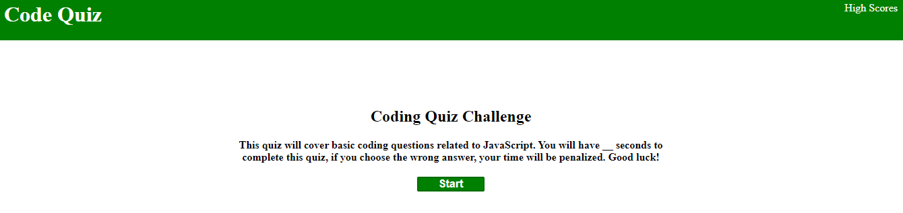

# ubiquitous-couscous

# Steps

## Starting out I set up my HTML page. This included my title, header (which includes and h1 of code quiz and an anchor tag that is labled high scores that takes you the the scores.html), a section for the name of the quiz and a breif description of the quiz and how to take it, and lastly a start button to start the quiz.

## I also had to link the javascript file for functionality and the css file for styling and positioning.

## within the script.js file i started out by setting variables for everything i wanted to target whether it was an id or a class.

## I then set a variable for my array of objects which list my questions, possible answers, and the correct answer.

## I then set a variable for the time, quizindex, and score. This shows the starting point of the score and time.

## I set up a function that would run through the questions, set up buttons for each of the possible answers, and based of which button was clicked for each question check if it was right or wrong.

## If it was right it would add 20 to the score and if it was wrong it would minus 10 from the time.

## The function also went through the array and if it got down to the last question then it would end the game.

## Upon my start button being clicked i had a function called setinterval that would decrease the time by 1 second unless the timer hit 0, then it would clear away the timer.

## in the function end game it clears the screen and displays what kind of score you got. It will also allow you to log your score in local storage and display it on the next screen with your initials.

## in the scores html i have a similar layout as the index html but it just displays a button to play again and clear the scores.

## in the scores js I have it using local storage to show the scores of any past scores.

# Screenshot of Deployed Application:

## 

# Link to the Deployed Application:

## https://zlyda1993.github.io/ubiquitous-couscous/
